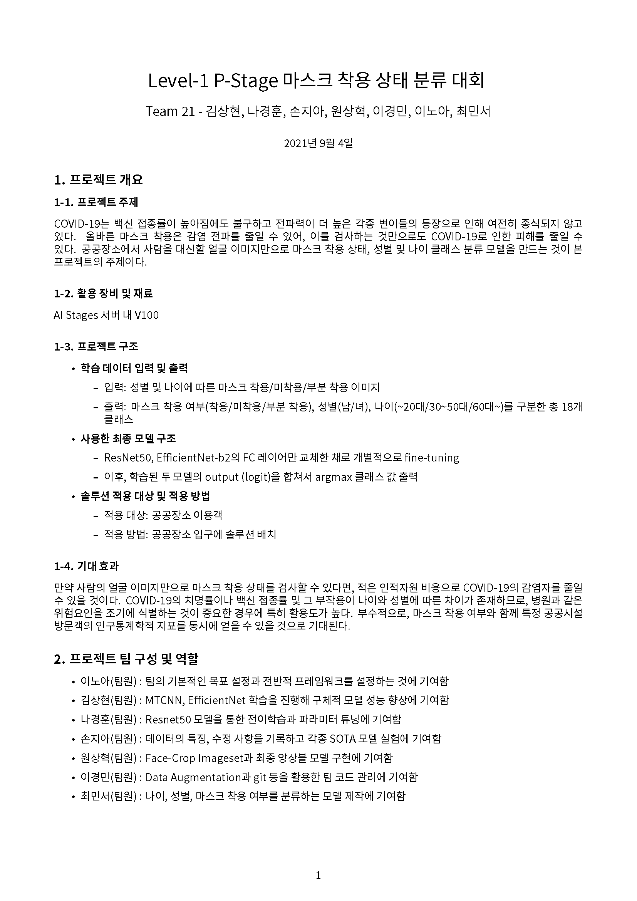

# TEAM 21 "BLACKJACK"

* ["TEAM 21 Notion"](https://team21.nannullna.dev)

* [TEAM 21 "BLACKJACK"](https://github.com/boostcampaitech2/image-classification-level1-21#team-21-blackjack)
  * [Image Classification Leaderboard](https://github.com/boostcampaitech2/image-classification-level1-21#image-classification-leaderboard)
  * [Model Visualization](https://github.com/boostcampaitech2/image-classification-level1-21#model-visualization)
    * [ResNet50](https://github.com/boostcampaitech2/image-classification-level1-21#resnet50)
    * [EfficientNet b2](https://github.com/boostcampaitech2/image-classification-level1-21#efficientnet-b2)
  * [Usage](https://github.com/boostcampaitech2/image-classification-level1-21#usage)
    * [Train](https://github.com/boostcampaitech2/image-classification-level1-21#train)
      * [Argument](https://github.com/boostcampaitech2/image-classification-level1-21#argument)
      * [Using Argument](https://github.com/boostcampaitech2/image-classification-level1-21#using-argument)
    * [Inference](https://github.com/boostcampaitech2/image-classification-level1-21#inference)
      * [Argument](https://github.com/boostcampaitech2/image-classification-level1-21#argument-1)
      * [Using Argument](https://github.com/boostcampaitech2/image-classification-level1-21#using-argument-1)

## Model Visualization


## Usage

### Train
#### Argument
```
( '--model'      , type=str   , default='Customresnet50'    )
( '--dataset'    , type=str   , default='MaskBaseDataset'   )
( '--data_dir'   , type=str   )
```
#### Using argument
```
$ python3 train.py --model Customresnet50 --dataset SplitByProfileDataset --data_dir /your/data/dir 
```


### Inference
#### Argument
```
( '--model'      , type=str   , default='EfficientResnet'   )
( '--data_dir'   , type=str   )
( '--model_dir'  , type=str   )
```

#### Using argument
```
$ python3 inference.py --model EfficientResnet --model_dir your/model/path.pth --data_dir /your/data/dir
```
## Final Report




